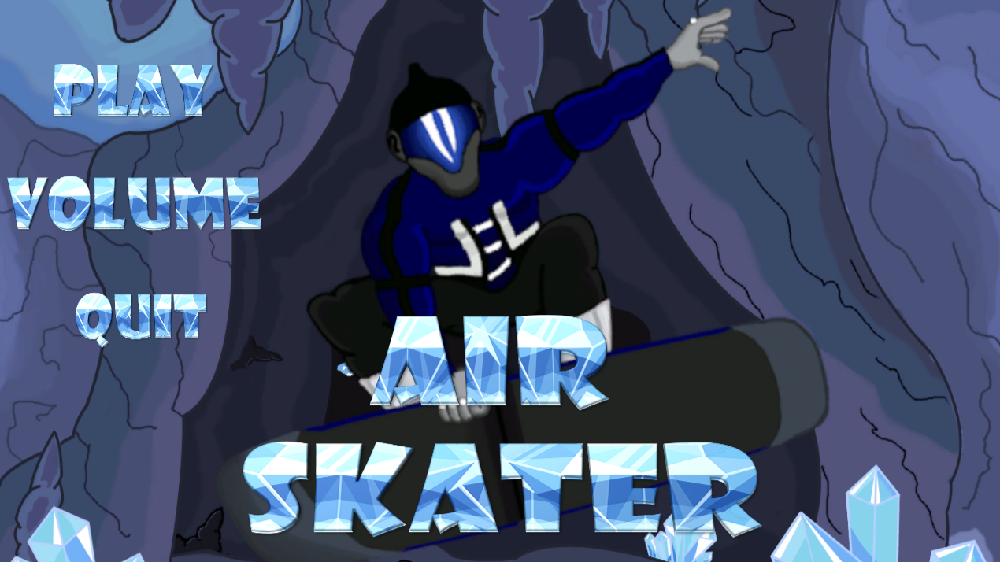
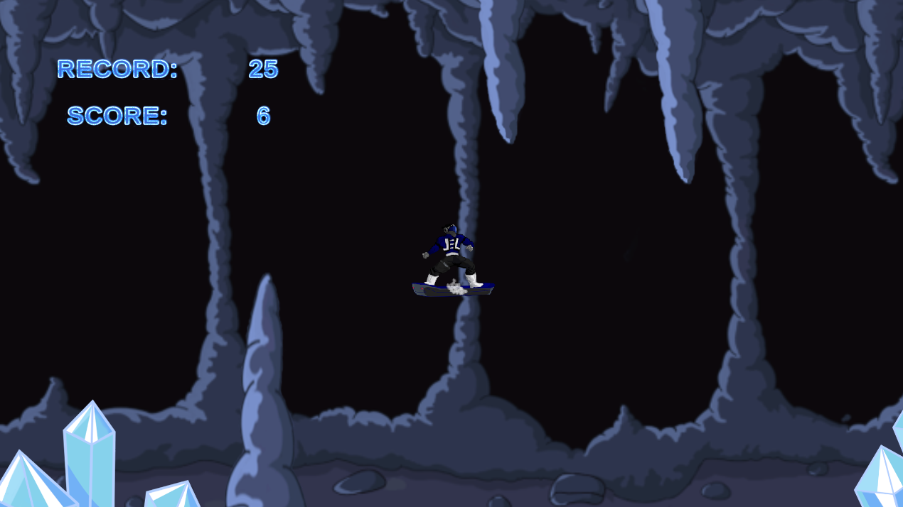
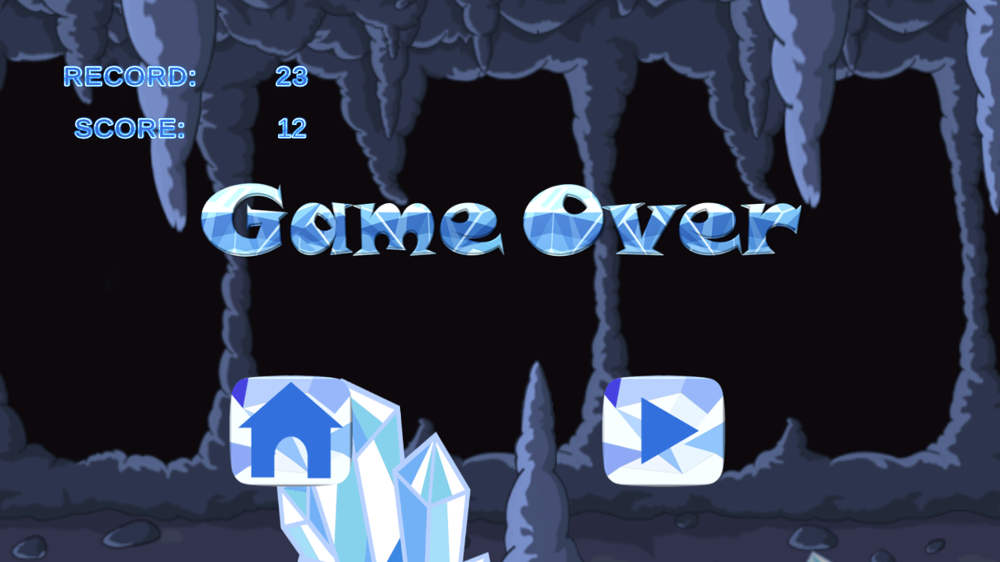
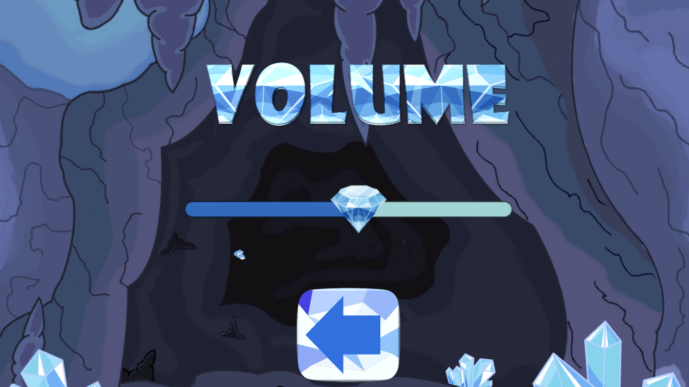

# Air Skater

An endless runner mobile game where you control a skater navigating through obstacles. Tap to jump and survive as long as you can while the difficulty increases!

**Developer:** Maleon Games  
**Engine:** Unity 2019.4.14f1 (LTS)  
**Platform:** Android

[Leer en Español](README-es.md)

---

## Screenshots

| Menu | Gameplay | Game Over | Volume |
|------|----------|-----------|--------|
|  |  |  |  |

---

## Gameplay Videoas

<video src="https://github.com/user-attachments/assets/df95422e-353c-4c9d-8885-64651d431ebf" controls width="100%">
  Your browser does not support the video element.
</video>

---

## Gameplay

- **Tap** anywhere on the screen to make the skater jump
- Avoid colliding with obstacles and stay within the screen boundaries
- Score increases every time you pass through a scoring area
- Difficulty scales progressively as your score increases:
  - Obstacles spawn faster
  - Obstacle movement speed increases
- Your **high score** is saved locally

> **Note:** This game is designed exclusively for mobile phones (Android). It is not intended for PC or tablet play.

---

## Features

- Endless runner with progressive difficulty
- Score tracking with persistent high score (PlayerPrefs)
- Background music and sound effects
- Adjustable volume settings
- Google AdMob integration
- Two scenes: Main Menu and Gameplay

---

## Project Structure

```
Air-Skater/
├── Assets/
│   ├── CODIGOS/            # C# Scripts
│   │   ├── LogicaPersonaje.cs          # Character controller (jump, collision)
│   │   ├── Controladordeescena.cs      # Scene controller (game over, restart)
│   │   ├── LogicaGeneradorObtaculos.cs # Obstacle spawner with difficulty scaling
│   │   ├── LogicaObstaculo.cs          # Obstacle movement
│   │   ├── LogicaPuntaje.cs            # Score display
│   │   ├── LogicaAreaPuntaje.cs        # Score trigger area
│   │   ├── PuntajeRecord.cs            # High score manager
│   │   ├── MenuPrincipal.cs            # Menu navigation
│   │   ├── ControlVolumen.cs           # Volume control
│   │   ├── MusicaMenu.cs               # Menu music
│   │   ├── AdMob.cs                    # AdMob initialization (menu)
│   │   ├── AdMobGame.cs                # AdMob initialization (game)
│   │   ├── Bloque.cs                   # Block behavior
│   │   └── MusicaPerder.cs             # Game over music
│   ├── Dibujos/            # Art assets (sprites, animations, backgrounds)
│   ├── Prefab/             # Prefabs (obstacles, UI, music)
│   ├── Scenes/             # Game scenes (MENU, JUEGO)
│   ├── Sonidos/            # Audio files (music, SFX)
│   ├── GoogleMobileAds/    # Google AdMob SDK
│   ├── Plugins/            # Native plugins
│   └── TextMesh Pro/       # TextMeshPro package
├── ProjectSettings/        # Unity project settings
├── Packages/               # Package manifest
└── SCREENSHOTS/            # Game screenshots
```

---

## Dependencies

| Package | Version |
|---------|---------|
| 2D Animation | 3.2.5 |
| 2D Pixel Perfect | 2.0.4 |
| 2D PSD Importer | 2.1.6 |
| 2D SpriteShape | 3.0.14 |
| TextMeshPro | 2.1.3 |
| Timeline | 1.2.17 |
| Google Mobile Ads | via scoped registry |

---

## Setup

1. Clone the repository
2. Open the project in **Unity 2019.4.14f1** or compatible version
3. Let Unity import all assets
4. Open `Assets/Scenes/MENU.unity` to start from the main menu
5. Build for Android via `File > Build Settings`

---

## Controls

| Action | Input |
|--------|-------|
| Jump | Tap |
| Navigate Menu | Tap on buttons |
